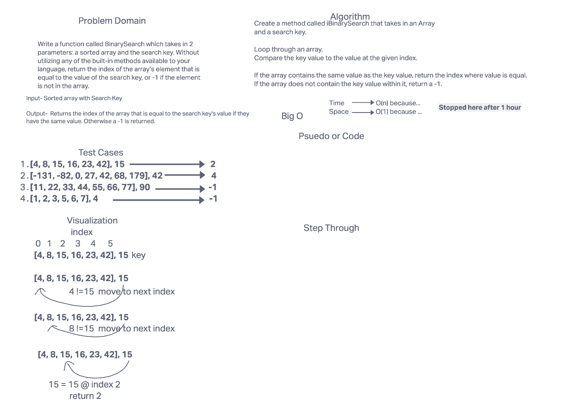

# Binary Search of Sorted Array

Write a function called BinarySearch which takes in 2 parameters: a sorted array and the search key. Without utilizing any of the built-in methods available to your language, return the index of the array’s element that is equal to the value of the search key, or -1 if the element is not in the array

## Whiteboard Process

## Approach & Efficiency

I tried to follow the guide to the best of my abilities. I identified the problem and visualized what needed to be done. I first wrote out how I would go about solving the problem. I have not wrote out any code to start solving the problem so I'm not wsure how efficent the solution would be.

