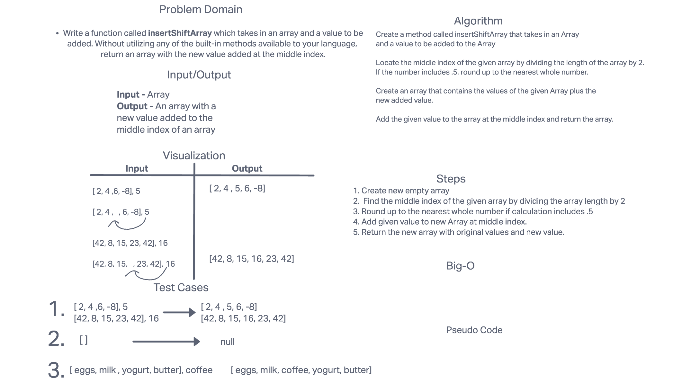

# Insert to Middle of an Array

Write a function called insertShiftArray which takes in an array and a value to be added. Without utilizing any of the built-in methods available to your language, return an array with the new value added at the middle index.

## Whiteboard Process

## Approach & Efficiency

I followed the layout that we were shown in class. I tried to finish each step before moving onto the next. I was unable top write out the code for this therefre I cannot answer this portion in its entirety.
