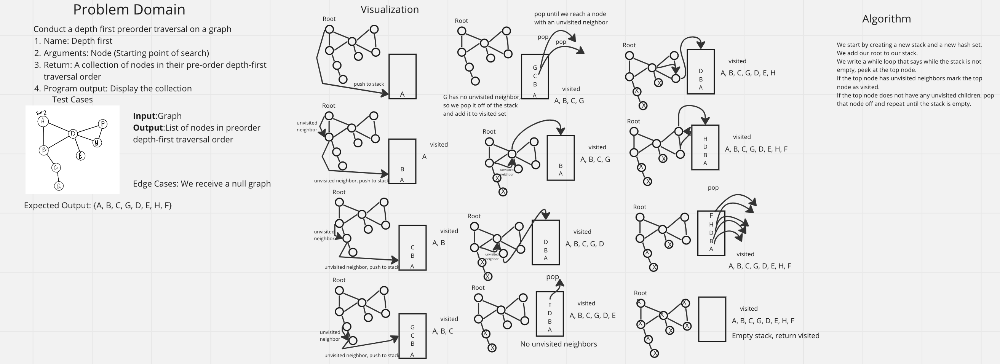

# Graph Business Trip

## Problem Domain
Conduct a depth first preorder traversal on a graphWrite a function called business trip
Write the following method for the Graph class:

Name: Depth first
Arguments: Node (Starting point of search)
Return: A collection of nodes in their pre-order depth-first traversal order
Program output: Display the collection

## Whiteboard Process

## Approach & Efficiency

## Collaboration

Used Alex's whiteboard as reference.
