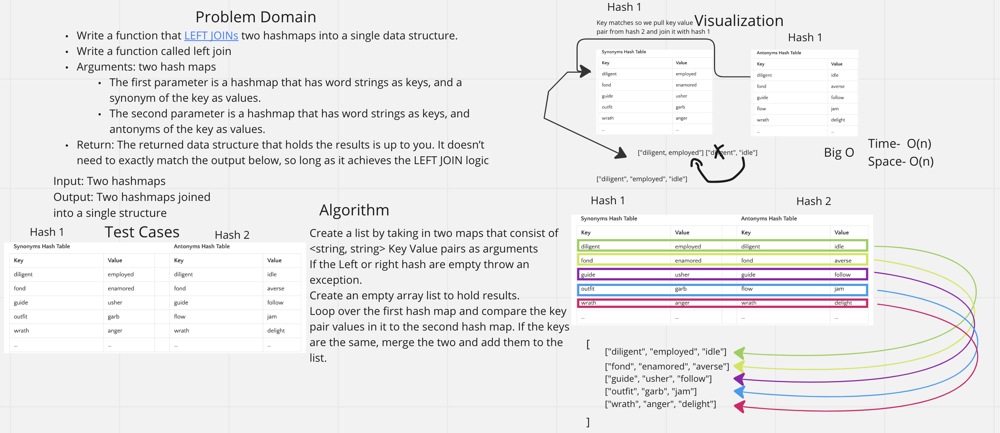

# Left Join Hashmap

## Problem Domain
Write a function called left join
Arguments: two hash maps
The first parameter is a hashmap that has word strings as keys, and a synonym of the key as values.
The second parameter is a hashmap that has word strings as keys, and antonyms of the key as values.
Return: The returned data structure that holds the results is up to you. It does not need to exactly match the output below, so long as it achieves the LEFT JOIN logic

## Whiteboard Process

## Approach & Efficiency
Attempted to join two hashmaps by comparing them and throwing the matching key pairs into a list.

## Collaboration
Got some assistance from the TAs for the code portion.
