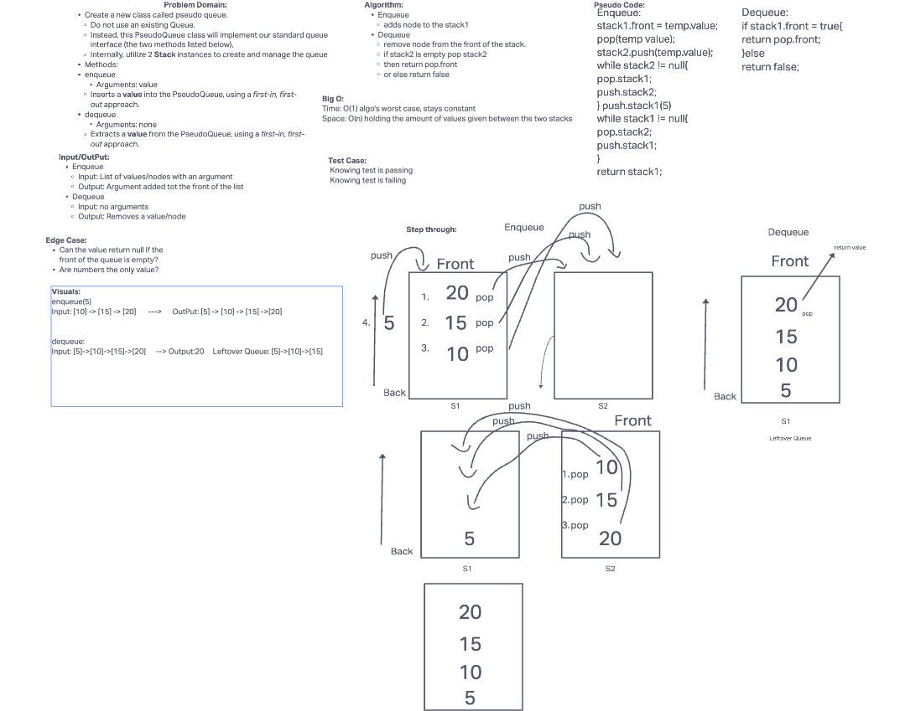

# stack-queue-pseudo

Create a new class called pseudo queue.
Do not use an existing Queue.
Instead, this PseudoQueue class will implement our standard queue interface (the two methods listed below),
Internally, utilize 2 Stack instances to create and manage the queue
- Method:enqueue
Arguments: value
Inserts a value into the PseudoQueue, using a first-in, first-out approach.
- Method: dequeue
Arguments: none
Extracts a value from the PseudoQueue, using a first-in, first-out approach.

## Whiteboard Process

## Approach & Efficiency

I attempted to finish the whiteboard and was unable to get it done. I did not get to the coding portion.
