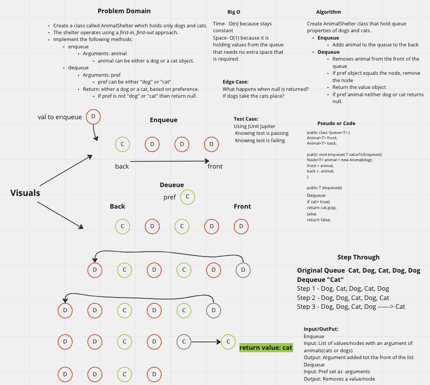

# stack-queue-animal-shelter

Create a class called AnimalShelter which holds only dogs and cats.
The shelter operates using a first-in, first-out approach.
Implement the following methods:

Enqueue
Arguments: animal
Animal can be either a dog or a cat object.

Dequeue
Arguments: pref
pref can be either "dog" or "cat"
Return: either a dog or a cat, based on preference.
If pref is not "dog" or "cat" then return null.

## Whiteboard Process

## Approach & Efficiency

I attempted to finish the whiteboard and was unable to get it done. I did not get to the coding portion.

## Collaboration
Collaborated with Sharmarker and Ryan. Got some assistance from Alex.
