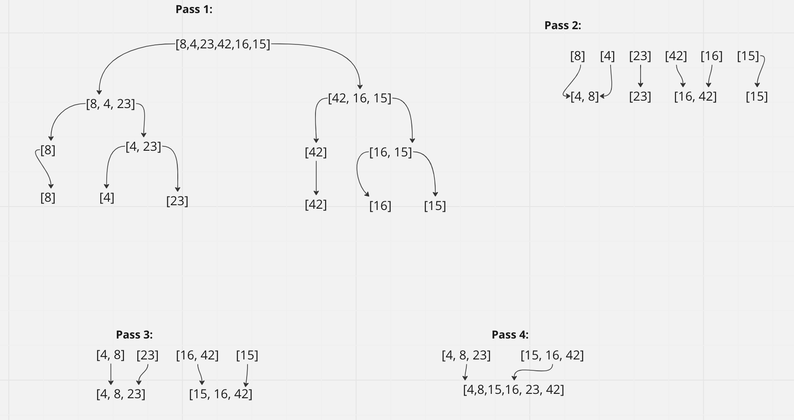

# Sorting Insertions

Review the pseudocode below, then trace the algorithm by stepping through the process with the provided sample array. Document your explanation by creating a blog article that shows the step-by-step output after each iteration through some sort of visual.
Once you are done with your article, code a working, tested implementation of Insertion Sort based on the pseudocode provided.

### Approach & Efficiency

Attempt was made to complete the tests but only have the code and image.

### Collaboration
Worked with Sharmarke and Ryan.

# Merge Sort

### Problem Domain

Review the pseudocode below, then trace the algorithm by stepping through the process with the provided sample array. Document your explanation by creating a blog article that shows the step-by-step output after each iteration through some sort of visual.
Once you are done with your article, code a working, tested implementation of Merge Sort based on the pseudocode provided.

### Approach & Efficiency

We were not able to make it to code.

### Collaboration
Worked with Sharmarke and Ryan.

