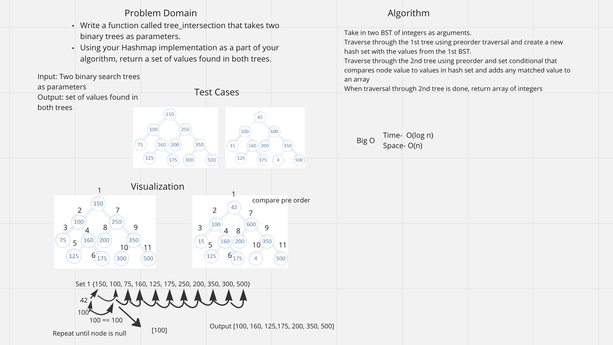

# Tree Intersection

## Problem Domain

Write a function called repeated word that finds the first word to occur more than once in a string
Arguments: string
Return: string

## Whiteboard Process

## Approach & Efficiency
Approach was to put values from one BST into a hash set and compare the values of another BST to the hash set.

## Collaboration
Worked with Sharmarke, Ryan, and Devon.
Used GeeksforGeeks code as a reference.
