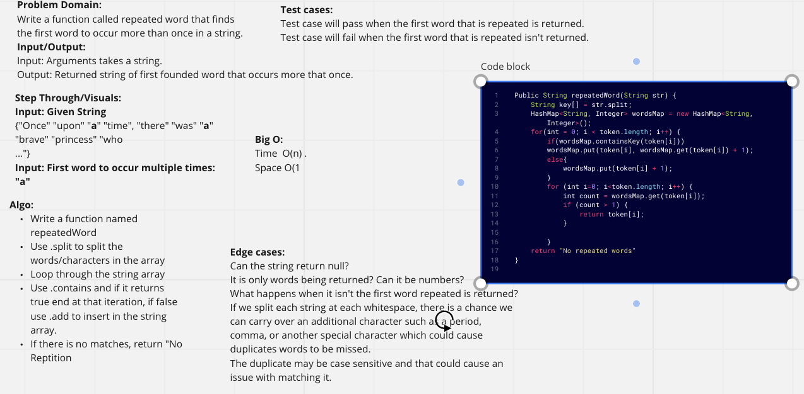

# Hashmap Repeated Word

## Problem Domain

Write a function called repeated word that finds the first word to occur more than once in a string
Arguments: string
Return: string

## Whiteboard Process

## Approach & Efficiency
Attempted to split string into a grouping of strings so that we could target individual words. We would then increment every time we come across a word.

## Collaboration
Worked with Sharmarke, Ryan, and Devon
