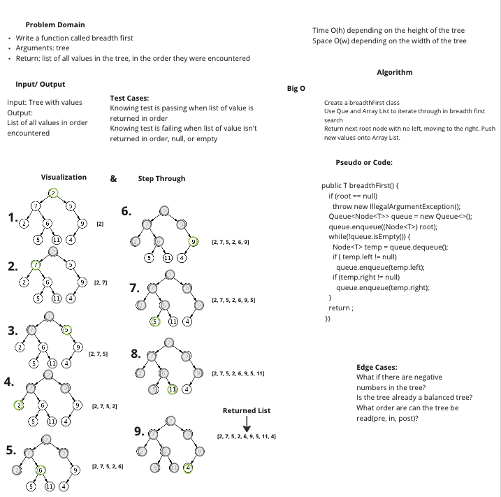

# Breadth First

Write a function called breadth first
Arguments: tree
Return: list of all values in the tree, in the order they were encountered

## Whiteboard Process

## Approach & Efficiency

I got to the whiteboard portion and did not get to the code because of time. I got stuck on the lab and dedicated more time to that.

I worked with Sharmarke, Ryan, and Devon on the whiteboard.
