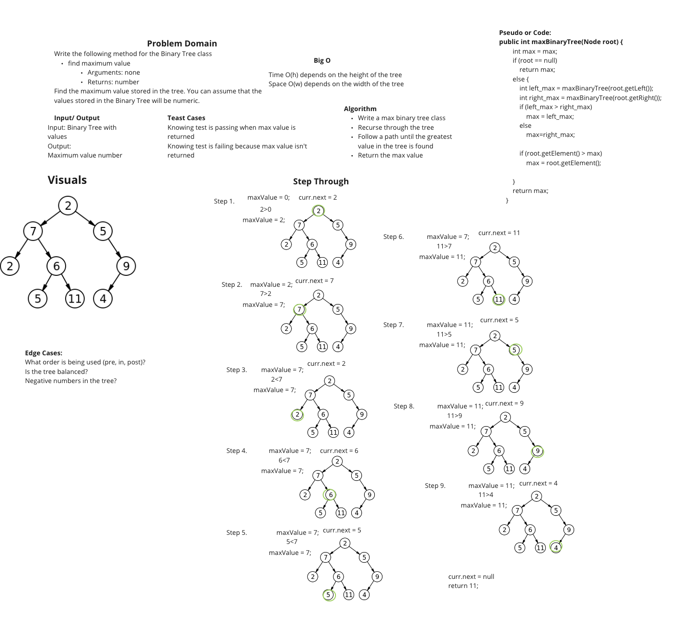

[# Linked List Insertions

Write the following method for the Binary Tree class
Find maximum value

Arguments: none
Returns: number
Find the maximum value stored in the tree. You can assume that the values stored in the Binary Tree will be numeric.

## Whiteboard Process

## Approach & Efficiency

I got to the whiteboard portion and did not get to the code because of time. I spent more time trying to finish the lab.

I worked with Sharmarke, Ryan, and Devon on the whiteboard.
